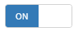
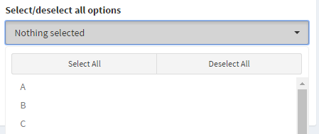

# shinyWidgets : Extend widgets available in shiny


This package provide some custom widgets to pimp your shiny apps !


Installation :
```r
# From CRAN
install.packages("shinyWidgets")

# From Github
# install.packages("devtools")
devtools::install_github("dreamRs/shinyWidgets")
```

Demo :
```r
shinyWidgets::shinyWidgetsGallery()
```

Or see the live version here : https://dreamrs-vic.shinyapps.io/shinyWidgets/

You can find an introduction (in french) [here](https://dreamrs.github.io/shinyWidgets/articles/intro_shinyWidgets_fr.html).

And how to construct a palette color picker [here](https://dreamrs.github.io/shinyWidgets/articles/palette_picker.html).


## Widgets available :

### Bootstrap switch

Turn checkboxes into toggle switches : <br>


```r
switchInput(inputId = "id", value = TRUE)
```

### Material switch

Turn checkboxes into toggle switches (again) : <br>


```r
materialSwitch(inputId = "id", label = "Primary switch", status = "primary", right = TRUE)
```


### Select picker

Dropdown menu with a lot of options : <br>


```r
pickerInput(
  inputId = "id", 
  label = "Select/deselect all options", 
  choices = LETTERS, options = list(`actions-box` = TRUE), 
  multiple = TRUE
 )
```

### Checkbox and radio buttons

Turn buttons into checkbox or radio : <br>


```r
checkboxGroupButtons(
  inputId = "somevalue", label = "Make a choice :", 
  choices = c("Choice A", "Choice B", " Choice C", "Choice D"), 
  justified = TRUE, status = "primary",
  checkIcon = list(yes = icon("ok", lib = "glyphicon"), no = icon("remove", lib = "glyphicon"))
)
```


### Search bar

A text input only triggered by hitting 'Enter' or clicking search button : <br>


```r
searchInput(
  inputId = "id", 
  label = "Enter your search :", 
  placeholder = "This is a placeholder", 
  btnSearch = icon("search"), 
  btnReset = icon("remove"), 
  width = "100%"
)
```


### Dropdown button

Hide input in a button : <br>


```r
dropdownButton(
  tags$h3("List of Input"),
  selectInput(inputId = 'xcol', label = 'X Variable', choices = names(iris)),
  selectInput(inputId = 'ycol', label = 'Y Variable', choices = names(iris), selected = names(iris)[[2]]),
  sliderInput(inputId = 'clusters', label = 'Cluster count', value = 3, min = 1, max = 9),
  circle = TRUE, status = "danger", icon = icon("gear"), width = "300px",
  tooltip = tooltipOptions(title = "Click to see inputs !")
)
```


And others !

