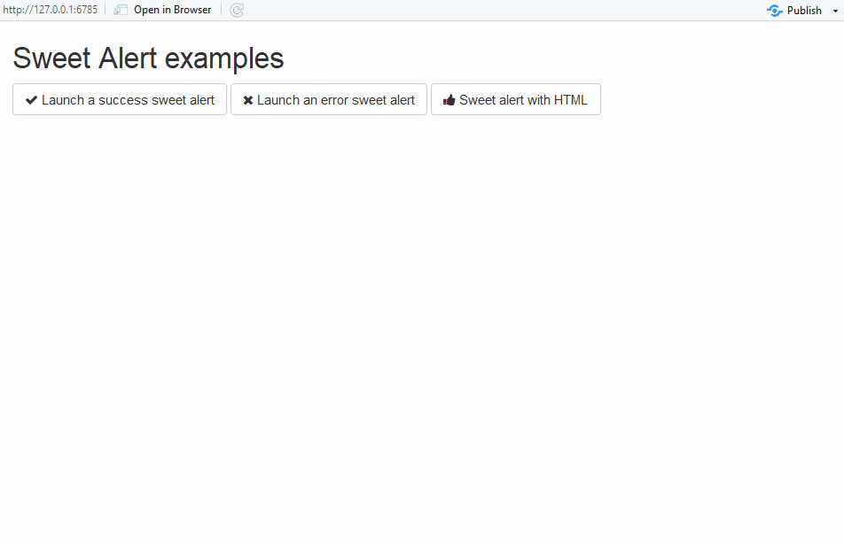
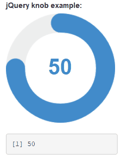

# shinyWidgets


> Extend widgets available in shiny

<!-- badges: start -->
[](https://travis-ci.org/dreamRs/shinyWidgets)
[](https://ci.appveyor.com/project/dreamRs/shinyWidgets)
[](https://CRAN.R-project.org/package=shinyWidgets)
[](https://CRAN.R-project.org/package=shinyWidgets)
[](https://cranchecks.info/pkgs/shinyWidgets)
[](https://codecov.io/github/dreamRs/shinyWidgets?branch=master)
<!-- badges: end -->


## Overview

This package provide some custom widgets to pimp your shiny apps !


You can replace classical checkboxes with switch button, add colors to radio buttons and checkbox group, use buttons as radio or checkboxes.
Each widget has an `update` method to change the value of an input from the server.


Installation :
```r
# From CRAN
install.packages("shinyWidgets")

# From Github
# install.packages("devtools")
devtools::install_github("dreamRs/shinyWidgets")
```

Demo :
```r
shinyWidgets::shinyWidgetsGallery()
```

A live version is available here : http://shinyapps.dreamrs.fr/shinyWidgets


## Widgets available :


  - [Bootstrap switch](#bootstrap-switch)
  - [Material switch](#material-switch)
  - [Pretty Checkbox](#pretty-checkbox)
  - [Sweet Alert](#sweet-alert)
  - [Slider Text](#slider-text)
  - [Knob Input](#knob-input)
  - [Select picker](#select-picker)
  - [Checkbox and radio buttons](#checkbox-and-radio-buttons)
  - [Search bar](#search-bar)
  - [Dropdown button](#dropdown-button)


### Bootstrap switch

Turn checkboxes into toggle switches : <br>


```r
switchInput(inputId = "id", value = TRUE)
```


### Material switch

Turn checkboxes into toggle switches (again) : <br>


```r
materialSwitch(inputId = "id", label = "Primary switch", status = "danger")
```


### Pretty Checkbox

Checkbox and radio buttons with the beautiful CSS library [pretty-checkbox](https://lokesh-coder.github.io/pretty-checkbox/) :


```r
prettyCheckbox(
  inputId = "pretty_1", label = "Check me!", icon = icon("check")
),
prettyCheckbox(
  inputId = "pretty_2", label = "Check me!", icon = icon("thumbs-up"), 
  status = "default", shape = "curve", animation = "pulse"
),
prettyCheckbox(
  inputId = "pretty_3", label = "Check me!", icon = icon("users"), 
  animation = "pulse", plain = TRUE, outline = TRUE
),
prettyCheckbox(
  inputId = "pretty_4", label = "Check me!",
  status = "success", outline = TRUE
),
prettyCheckbox(
  inputId = "pretty_5", label = "Check me!",
  shape = "round", outline = TRUE, status = "info"
),

...

```


### Sweet Alert

Displays a message to the user :



See examples in `?sendSweetAlert`.


Request confirmation from the user :


See examples in `?confirmSweetAlert`.


### Slider Text

Slider with strings, to pass whatever you want : <br>


```r
sliderTextInput(
  inputId = "mySliderText", 
  label = "Your choice:", 
  grid = TRUE, 
  force_edges = TRUE,
  choices = c("Strongly disagree",
              "Disagree", "Neither agree nor disagree", 
              "Agree", "Strongly agree")
)
```


### Knob Input

A [jQuery](https://github.com/aterrien/jQuery-Knob) based knob, similar to sliderInput or sliderTextInput: <br>


```r
knobInput(
  inputId = "myKnob",
  label = "jQuery knob example:",
  value = 0,
  min = -100,
  displayPrevious = TRUE, 
  lineCap = "round",
  fgColor = "#428BCA",
  inputColor = "#428BCA"
)
```

### Select picker

Dropdown menu with a lot of options : <br>


```r
pickerInput(
  inputId = "myPicker", 
  label = "Select/deselect all + format selected", 
  choices = LETTERS, 
  options = list(
    `actions-box` = TRUE, 
    size = 10,
    `selected-text-format` = "count > 3"
  ), 
  multiple = TRUE
)
```


### Checkbox and radio buttons

Turn buttons into checkbox or radio : <br>


```r
checkboxGroupButtons(
  inputId = "somevalue", label = "Make a choice :", 
  choices = c("Choice A", "Choice B", " Choice C", "Choice D"), 
  justified = TRUE, status = "primary",
  checkIcon = list(yes = icon("ok", lib = "glyphicon"), no = icon("remove", lib = "glyphicon"))
)
```


### Search bar

A text input only triggered by hitting 'Enter' or clicking search button : <br>


```r
searchInput(
  inputId = "id", 
  label = "Enter your search :", 
  placeholder = "This is a placeholder", 
  btnSearch = icon("search"), 
  btnReset = icon("remove"), 
  width = "100%"
)
```


### Dropdown button

Hide input in a button : <br>


```r
dropdownButton(
  tags$h3("List of Input"),
  selectInput(inputId = 'xcol', label = 'X Variable', choices = names(iris)),
  selectInput(inputId = 'ycol', label = 'Y Variable', choices = names(iris), selected = names(iris)[[2]]),
  sliderInput(inputId = 'clusters', label = 'Cluster count', value = 3, min = 1, max = 9),
  circle = TRUE, status = "danger", icon = icon("gear"), width = "300px",
  tooltip = tooltipOptions(title = "Click to see inputs !")
)
```


And others !

