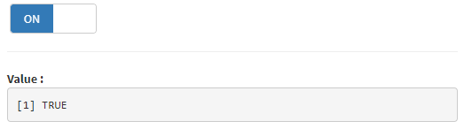
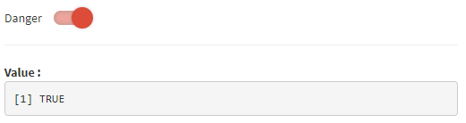
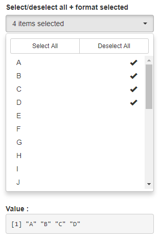
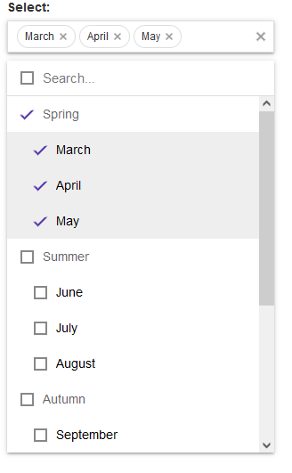
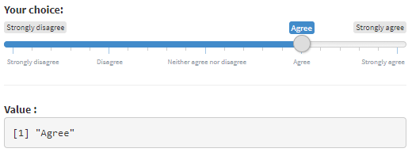
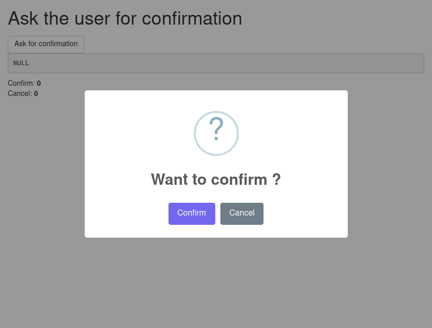

# shinyWidgets

> Extend widgets available in [shiny](https://github.com/rstudio/shiny)

<!-- badges: start -->
[](https://CRAN.R-project.org/package=shinyWidgets)
[](https://CRAN.R-project.org/package=shinyWidgets)
[](https://cran.r-project.org/web/checks/check_results_shinyWidgets.html)
[](https://app.codecov.io/github/dreamRs/shinyWidgets?branch=master)
[](https://ci.appveyor.com/project/dreamRs/shinyWidgets)
[](https://github.com/dreamRs/shinyWidgets/actions/workflows/R-CMD-check.yaml)
<!-- badges: end -->


## Overview

This package provide custom widgets and other components to enhance your shiny applications.

You can replace classical checkboxes with switch button, add colors to radio buttons and checkbox group, use buttons as radio or checkboxes.
Each widget has an `update` method to change the value of an input from the server.


## Installation

Install from [CRAN](https://CRAN.R-project.org/package=shinyWidgets) with:

```r
install.packages("shinyWidgets")
```

Or install the development version from [GitHub](https://github.com/dreamRs/shinyWidgets) with:

```r
# install.packages("remotes")
remotes::install_github("dreamRs/shinyWidgets")
```


## Demo

A gallery application is included in the package. Once installed, use the following command to launch it:

```r
shinyWidgets::shinyWidgetsGallery()
```

A live version is available here : http://shinyapps.dreamrs.fr/shinyWidgets


## Widgets

### Single checkbox

* **Bootstrap switch**

Turn checkboxes into toggle switches : 



```r
switchInput(inputId = "id", value = TRUE)
```


* **Material switch**

Turn checkboxes into toggle switches :



```r
materialSwitch(inputId = "id", label = "Primary switch", status = "danger")
```


* **Pretty checkbox**

```r
prettyCheckbox(
  inputId = "id", label = "Check me!", icon = icon("check")
)
```


* **Pretty switch**

```r
prettySwitch(
  inputId = "id",
  label = "Switch:",
  fill = TRUE, 
  status = "primary"
)
```


* **Pretty toggle**

```r
prettyToggle(
  inputId = "id",
  label_on = "Checked!",
  label_off = "Unchecked..."
)
```

### Checkboxes and radio buttons

* **Bootstrap buttons**


```r
checkboxGroupButtons( # or radioGroupButtons
  inputId = "id",
  label = "Choice: ",
  choices = c("A", "B", "C")
)
```

* **Pretty checkbox group and radio buttons**

```r
prettyCheckboxGroup( # or prettyRadioButtons
  inputId = "id",
  label = "Choice",
  choices = c("A", "B", "c"),
  outline = TRUE,
  plain = TRUE,
  status = "primary",
  icon = icon("check")
)
```


### Select menu

* **Bootstrap select picker**

Select menu with lot of configurations options available:



```r
pickerInput(
  inputId = "id", 
  label = "Select:", 
  choices = month.name, 
  options = pickerOptions(
    actionsBox = TRUE, 
    size = 10,
    selectedTextFormat = "count > 3"
  ), 
  multiple = TRUE
)
```

* **Virtual select**

Select menu that can support long list of choices:



```r
virtualSelectInput(
  inputId = "id",
  label = "Select:",
  choices = list(
    "Spring" = c("March", "April", "May"),
    "Summer" = c("June", "July", "August"),
    "Autumn" = c("September", "October", "November"),
    "Winter" = c("December", "January", "February")
  ),
  showValueAsTags = TRUE,
  search = TRUE,
  multiple = TRUE
)
```


### Date picker

* **Air Datepicker**

Date (or month or year) picker with lot of options and a timepicker integrated :


```r
airDatepickerInput(
  inputId = "id",
  label = "Select:",
  placeholder = "Placeholder",
  multiple = 5, 
  clearButton = TRUE
)
```

### Sliders

* **Slider with Text**

Slider with strings, to pass whatever you want:



```r
sliderTextInput(
  inputId = "id", 
  label = "Choice:", 
  grid = TRUE, 
  force_edges = TRUE,
  choices = c(
    "Strongly disagree",
    "Disagree",
    "Neither agree nor disagree", 
    "Agree", 
    "Strongly agree"
  )
)
```


* **noUiSlider**

A range slider that can be colored, have more than two handles and positioned vertically (among other things):


```r
noUiSliderInput(
  inputId = "id",
  label = "Select:",
  min = 0, 
  max = 600,
  value = c(100, 220, 400),
  tooltips = TRUE,
  step = 1
)
```


### Tree

* **Tree check**

Select value(s) in a hierarchical structure:


```r
treeInput(
  inputId = "ID2",
  label = "Select cities:",
  choices = create_tree(cities),
  returnValue = "text",
  closeDepth = 1
)
```


### Text

* **Search**

A text input only triggered by hitting 'Enter' or clicking search button : 


```r
searchInput(
  inputId = "id", 
  label = "Enter your search :", 
  placeholder = "This is a placeholder", 
  btnSearch = icon("search"), 
  btnReset = icon("remove"), 
  width = "100%"
)
```


## Other functionnalities

### Sweet Alert

Show an alert message to the user to provide some feedback, via [sweetalert2](https://sweetalert2.github.io/) library:


See examples in `?show_alert`.


Request confirmation from the user :



See examples in `?ask_confirmation`.


### Dropdown button

Hide input in a button : <br>


```r
dropdownButton(
  tags$h3("List of Input"),
  selectInput(inputId = 'xcol', label = 'X Variable', choices = names(iris)),
  selectInput(inputId = 'ycol', label = 'Y Variable', choices = names(iris), selected = names(iris)[[2]]),
  sliderInput(inputId = 'clusters', label = 'Cluster count', value = 3, min = 1, max = 9),
  circle = TRUE,
  status = "danger", 
  icon = icon("gear"), width = "300px",
  tooltip = tooltipOptions(title = "Click to see inputs !")
)
```

See also `?dropMenu()`

